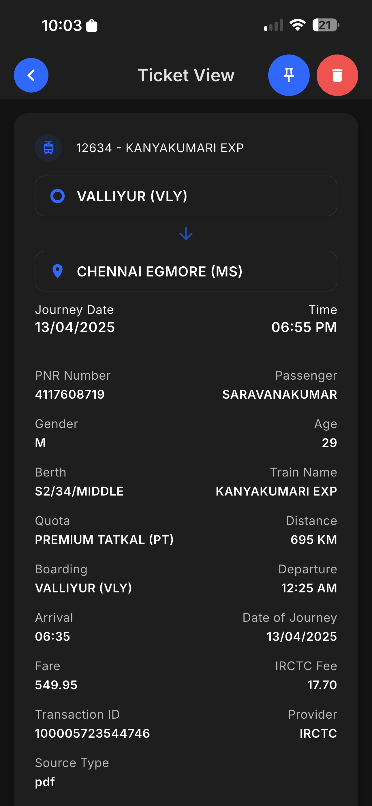
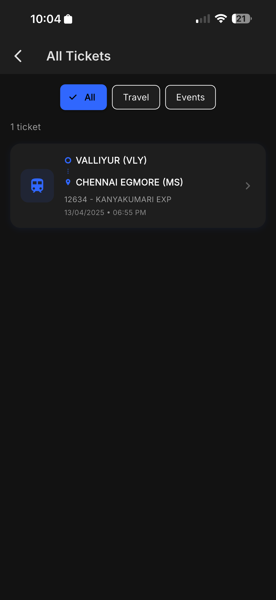
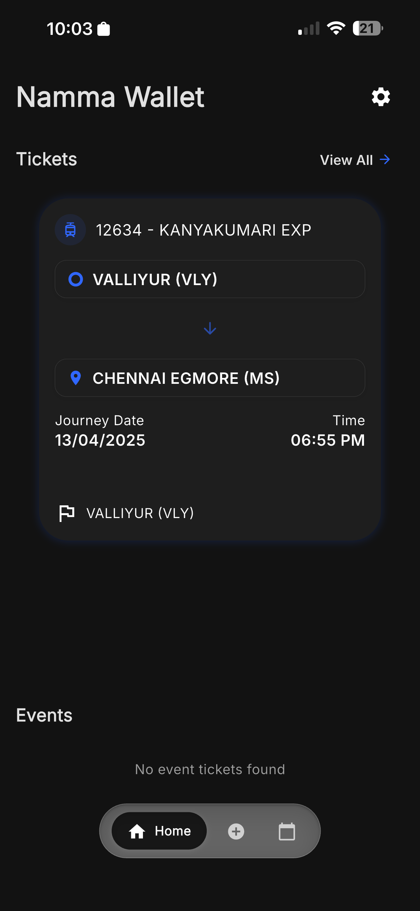
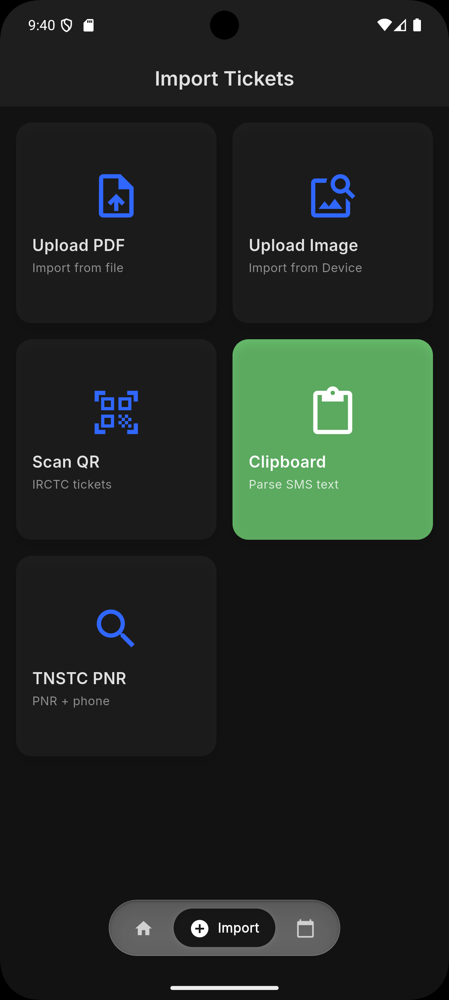
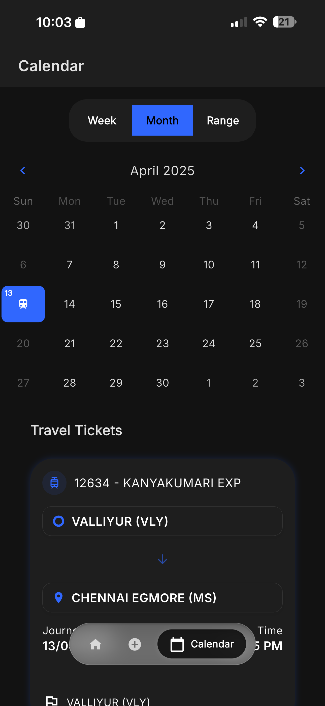
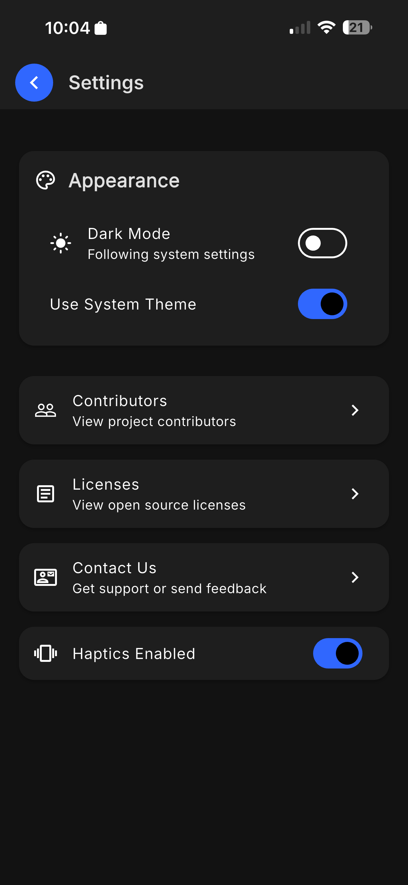

# Namma Wallet

**Namma Wallet** is an open-source Flutter mobile application for managing digital travel tickets and passes. It provides a unified interface to save, organise, and view tickets from multiple sources, including SMS, PDFs, QR codes, and clipboard text. The app features intelligent parsing for Indian transport providers and generates beautiful digital ticket designs. Unlike Apple Wallet or Google Wallet, which support only specific formats, Namma Wallet is a flexible, community-driven solution that works with any ticket type and format.

[](#contributors-)

[](https://play.google.com/store/apps/details?id=com.nammaflutter.nammawallet) [](https://apps.apple.com/in/app/namma-wallet/id6757295408)

---

## Table of Contents

- [Features](#features)
- [Screenshots](#screenshots)
- [Getting Started](#getting-started)
  - [Prerequisites](#prerequisites)
  - [Project Architecture](#project-architecture)
  - [Setup & Installation](#setup--installation)
  - [Development Commands](#development-commands)
- [Building the App](#building-the-app)
- [Deployment](#deployment)
- [Development Notes](#development-notes)
- [Contributing](#contributing)
- [License](#license)
- [Acknowledgements](#acknowledgements)
- [Contributors](#contributors)

---

## Features

### Multi-Source Ticket Management

* **SMS Parsing** – Automatically extract tickets from TNSTC, IRCTC, and SETC SMS messages
* **PDF Processing** – Parse TNSTC bus tickets from PDF files using Syncfusion PDF library
* **Image Processing** - Parse District movie tickets from Images
* **QR Code Scanning** – Scan IRCTC train ticket QR codes with full metadata extraction
* **Clipboard Processing** – Read and parse travel ticket text from the clipboard

### Supported Ticket Types

* **Bus Tickets** – TNSTC (Tamil Nadu State Transport), SETC (State Express Transport)
* **Train Tickets** – IRCTC with complete QR code support and PNR lookup
* **Event Tickets** – Concert, movie, and general event passes
* **Flight/Metro** – Model support for future implementations

### Apple Wallet Pass (.pkpass) Support

Namma Wallet can import and display `.pkpass` files — the standard format used by Apple Wallet for boarding passes, event tickets, coupons, and store cards.

**Supported pass types:**

| Pass type | Examples |
| --- | --- |
| Boarding Pass | Flights, trains, buses |
| Event Ticket | Concerts, conferences, sports |
| Coupon | Discount and loyalty passes |
| Store Card | Membership and reward cards |
| Generic | Any other pass format |

**How to import a `.pkpass` file:**

* **Share** — Open a `.pkpass` file from Mail, Safari, Files, or any app and share it to Namma Wallet
* **File picker** — Use the import screen to pick a `.pkpass` file directly
* **Deep link** — Open a `.pkpass` file with Namma Wallet set as the default handler

**What gets extracted:**

* Ticket ID, PNR, or confirmation number (from barcode or pass fields)
* Origin → Destination or event name
* Date, time, and relevant location
* Gate, seat, platform, or venue details
* Pass thumbnail or logo image
* Provider/organisation name

**Pass updates:**

Passes that include a `webServiceURL` (e.g. Luma event passes) are automatically refreshed from the provider's server using the standard Apple Pass web service protocol.

---

## Screenshots

| Home | All Tickets | Ticket View |
| --- | --- | --- |
|  |  |  |

| Import | Calendar | Settings |
| --- | --- | --- |
|  |  |  |

---

## Getting Started

### Prerequisites

* **Flutter SDK** - 3.44.9 (managed via FVM)
* **Android Studio** / **Xcode** - For mobile app development
* **Xcode** - 16.4.0 (for iOS development)
* **FVM** - Flutter Version Management (recommended)

### Project Architecture

This app follows a **feature-based architecture** with clean separation of concerns:

```text
lib/src/
├── app.dart                    # Main app widget with navigation
├── common/                     # Shared utilities and services
│   ├── helper/                 # Helper functions and utilities
│   ├── routing/                # Go Router configuration
│   ├── services/               # Core services (database, sharing)
│   ├── theme/                  # App theming and styles
│   └── widgets/                # Shared UI components
└── features/                   # Feature modules
    ├── bottom_navigation/      # Navigation bar implementation
    ├── calendar/               # Calendar view with events
    ├── clipboard/              # Clipboard text processing
    ├── events/                 # Event management
    ├── export/                 # Data export functionality
    ├── home/                   # Main home page with ticket cards
    ├── irctc/                  # IRCTC train ticket support
    ├── pdf_extract/            # PDF parsing services
    ├── profile/                # User profile and settings
    ├── scanner/                # QR/PDF scanning interface
    ├── sms_extract/            # SMS ticket extraction
    ├── tnstc/                  # TNSTC bus ticket support
    └── travel/                 # Travel ticket display
```

### Setup & Installation

```bash
# Clone the repository
git clone https://github.com/<your-username>/namma_wallet.git
cd namma_wallet

# Install FVM (if not already installed)
dart pub global activate fvm

# Use Flutter 3.44.9 via FVM
fvm use 3.44.9

# Get dependencies
fvm flutter pub get

# Run the app (specify device with -d flag)
fvm flutter run

# For specific device
fvm flutter run -d <device-id>
```

### Development Commands

```bash
# Analyze code
fvm flutter analyze

# Run SwiftLint for iOS
cd ios && swiftlint

# Run tests (when available)
fvm flutter test
```

---

## Building the App

**⚠️ IMPORTANT: Always use the Makefile for building releases. Never use `flutter build` commands directly.**

The project includes a `Makefile` that handles all necessary build steps, including critical optimizations like WASM module removal. By default, it uses FVM (`fvm flutter` and `fvm dart`), but you can override this behaviour.

### Available Targets

**Utility Commands:**

```bash
make help       # Display all available commands
make clean      # Clean the project
make get        # Get dependencies
make codegen    # Run code generation
```

**Release Builds (ALWAYS USE THESE):**

```bash
make release-apk        # Build Android release APK
make release-appbundle  # Build Android release App Bundle
make release-ipa        # Build iOS release IPA
```

### Why Use Makefile?

All release builds automatically:

1. Get dependencies (`fvm flutter pub get`)
2. Run code generation (`build_runner`)
3. **Remove WASM modules** (via `dart run pdfrx:remove_wasm_modules`) - **Required for pdfrx package**
4. Build the release version

**Skipping the Makefile will result in bloated app sizes and potential build issues.**

### Using Without FVM

If you're not using FVM, override the `FLUTTER` and `DART` variables:

```bash
# Build with regular Flutter/Dart
FLUTTER=flutter DART=dart make release-apk

# Or export them for the session
export FLUTTER=flutter
export DART=dart
make release-apk
```

### Fastlane Integration

Our fastlane scripts use the Makefile internally to ensure consistent builds across all environments.

---

## Deployment

Deployments are managed via Fastlane. Each platform has three lanes that mirror the same release pipeline.

### Release Pipeline

```text
Beta (closed testing) → Release Candidate (open/external testing) → Production
```

| Stage | Android track | iOS destination |
| --- | --- | --- |
| Beta | `namma-flutter-int-track` | TestFlight |
| Release Candidate | Open Testing (`beta`) | NammaFlutter + External groups |
| Production | Production | App Store |

### Fastlane Setup

Install Fastlane bundle dependencies before running any lane:

```bash
cd android && bundle install && cd ..
cd ios && bundle install && cd ..
```

Each platform requires a `.env.local` file in its `fastlane/` directory with the required credentials